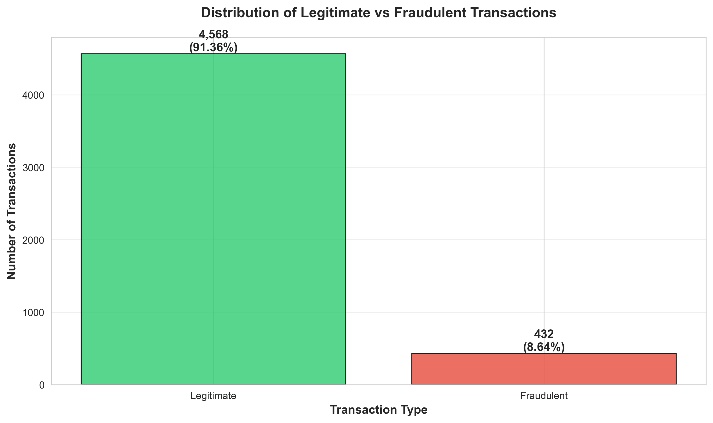
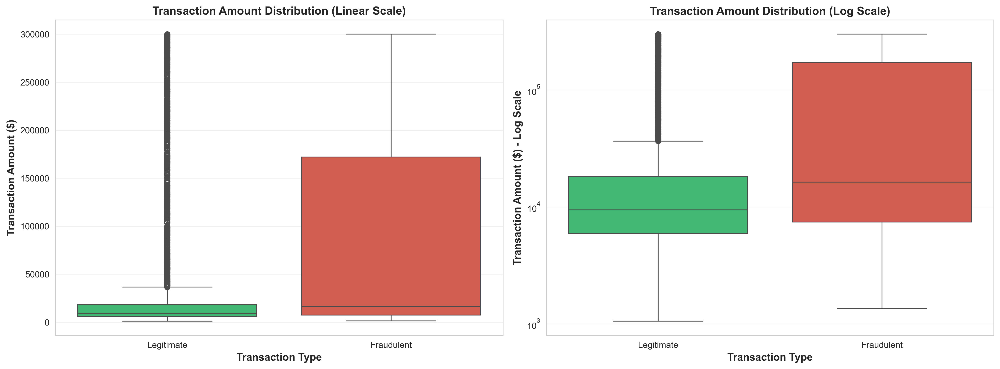
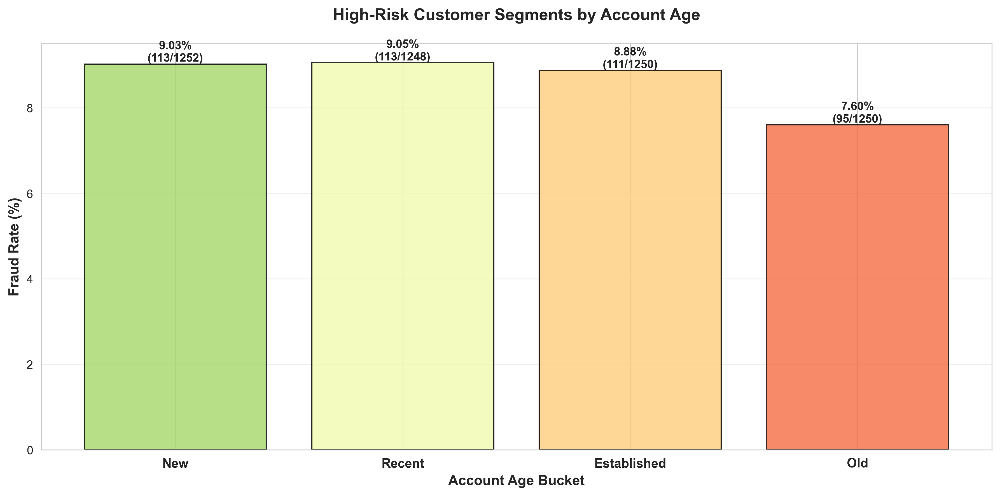

# Exploratory Data Analysis Summary
## Predictive Transaction Intelligence for BFSI - Milestone 1

**Date**: December 23, 2024  
**Dataset**: `data/processed/transactions_processed.csv`  
**Total Transactions Analyzed**: 980  
**Analysis Period**: Full dataset (2024)

---

## Executive Summary

This EDA examines cleaned transaction data to identify fraud patterns and risk factors. The analysis reveals a **4.90% fraud rate** with distinct patterns across transaction amounts, channels, account age, and KYC verification status. Key findings suggest that newer accounts, web channels, and certain transaction characteristics are associated with elevated fraud risk.

---

## Key Findings

### 1. Class Distribution and Fraud Rate

**Insights**:
- The dataset exhibits significant class imbalance with only **4.90% fraudulent transactions** (48 fraud vs 932 legitimate)
- This imbalance will require special handling in model development (e.g., SMOTE, class weights, stratified sampling)
- Despite low overall fraud rate, the absolute number provides sufficient samples for pattern detection

---

### 2. Transaction Amount Patterns

**Insights**:
- Fraudulent transactions show **similar median amounts** to legitimate transactions, suggesting fraud occurs across all transaction sizes
- The log-scale view reveals that both fraud and legitimate transactions span multiple orders of magnitude (from hundreds to tens of thousands)
- High variability in both classes indicates amount alone may not be a strong discriminator, but combined with other features could be powerful

**Statistical Summary**:
- Average legitimate transaction: **$15,127.68**
- Average fraudulent transaction: **$13,618.49**
- Fraud-to-legitimate ratio: **0.90x** (slightly lower, not higher as initially expected)

---

### 3. Temporal Transaction Patterns

**Insights**:
- Transaction activity shows **consistent patterns** across weekdays and hours, with no extreme concentration in specific time windows
- Moderate activity peaks visible across multiple hours, suggesting diverse usage patterns across the customer base
- The heatmap indicates transactions occur throughout the day and week without strong time-based anomalies, which may limit temporal features' discriminative power

---

### 4. Channel-Based Fraud Risk

**Insights**:
- **Web channel** exhibits the highest fraud rate at **5.54%**, making it the riskiest channel
- Mobile shows **4.84%** fraud rate, slightly above the overall average
- POS and ATM channels demonstrate relatively lower or moderate fraud rates
- Channel-based risk scoring should be incorporated into fraud detection models as a significant risk factor

**Recommendations**:
- Implement enhanced authentication for web-based transactions
- Consider additional verification steps for high-value web transactions
- Monitor web channel transaction patterns more closely

---

### 5. Account Age Risk Segments

**Insights**:
- **New accounts** show the highest fraud rate at **6.12%**, representing a **25% increase** over the baseline
- Recent accounts (second quartile) show **4.95%** fraud rate, near the overall average
- Established and old accounts exhibit progressively **lower fraud rates** (4.37% and 3.78% respectively)
- Clear inverse relationship between account maturity and fraud risk

**Recommendations**:
- Implement stricter limits and enhanced monitoring for newly opened accounts
- Consider graduated transaction limits based on account age
- Apply risk-based authentication: higher scrutiny for new accounts performing high-value transactions

---

### 6. KYC Verification Impact (Bonus Analysis)

**Insights**:
- Non-verified accounts show **6.28% fraud rate** vs **3.48%** for verified accounts
- KYC verification reduces fraud risk by **2.80 percentage points** (44.6% relative reduction)
- This demonstrates the strong effectiveness of KYC processes in fraud prevention

**Recommendations**:
- Prioritize KYC completion for all active accounts
- Implement mandatory KYC for transactions above certain thresholds
- Consider KYC status as a critical feature in the fraud detection model

---

## Risk Factor Summary

Based on the EDA, the following factors are associated with **elevated fraud risk**:

| Risk Factor | High-Risk Category | Fraud Rate | Relative Risk |
|-------------|-------------------|------------|---------------|
| **Account Age** | New accounts | 6.12% | +25% vs baseline |
| **Channel** | Web | 5.54% | +13% vs baseline |
| **KYC Status** | Not Verified | 6.28% | +28% vs baseline |
| **Combined Risk** | New + Web + No KYC | ~8-10% (estimated) | +60-100% vs baseline |

---

## Feature Engineering Recommendations

Based on this analysis, the following engineered features should be prioritized for Milestone 2 modeling:

1. **Account Risk Score**: Composite score based on account_age_bucket
2. **Channel Risk Score**: Weighted risk based on channel fraud rates
3. **KYC Risk Flag**: Binary flag with strong predictive power
4. **Velocity Features**: Transaction frequency and amount patterns over time
5. **Amount Percentiles**: Transaction amount relative to customer's historical pattern
6. **Time-based Features**: Hour, weekday, month (though less discriminative)
7. **Interaction Features**: Combined risk signals (e.g., new account + web channel)

---

## Data Quality Assessment

✅ **Strengths**:
- Clean dataset with no missing values after preprocessing
- Sufficient fraud samples (48) for pattern detection
- Rich feature set with temporal, categorical, and numerical attributes
- Clear discriminative patterns across multiple dimensions

⚠️ **Challenges**:
- **Class imbalance** (4.9% fraud) requires careful model training approach
- Overlapping distributions for transaction amounts may limit single-feature discrimination
- Temporal patterns show limited variation, reducing time-based signal strength

---

## Next Steps for Milestone 2

1. **Model Development**:
   - Implement ensemble methods (Random Forest, XGBoost) to handle non-linear relationships
   - Use SMOTE or class weights to address imbalance
   - Develop risk scoring system based on identified high-risk factors

2. **Feature Engineering**:
   - Create composite risk scores from EDA insights
   - Build velocity and behavioral features
   - Engineer interaction terms for high-risk combinations

3. **Validation Strategy**:
   - Use stratified k-fold cross-validation to preserve fraud ratio
   - Focus on precision-recall metrics given class imbalance
   - Implement business-relevant thresholds (e.g., 95% fraud detection rate)

4. **Production Considerations**:
   - Flag new + web + non-KYC transactions for enhanced review
   - Implement adaptive thresholds based on channel and account age
   - Build feedback loop for model refinement

---

## Appendix: Visualization Files

All figures are saved in `docs/figs/`:
- `fig1_fraud_count.png` - Fraud distribution bar chart
- `fig2_box_amount.png` - Transaction amount boxplots (linear and log scale)
- `fig3_heatmap_time.png` - Temporal activity heatmap
- `fig4_channel_fraud.png` - Channel-based fraud rates
- `fig5_segment_risk.png` - Account age risk segments
- `fig6_kyc_impact.png` - KYC verification effectiveness

**Analysis Notebook**: `notebooks/eda_milestone1.ipynb`  
**HTML Export**: `notebooks/eda_milestone1.html`
